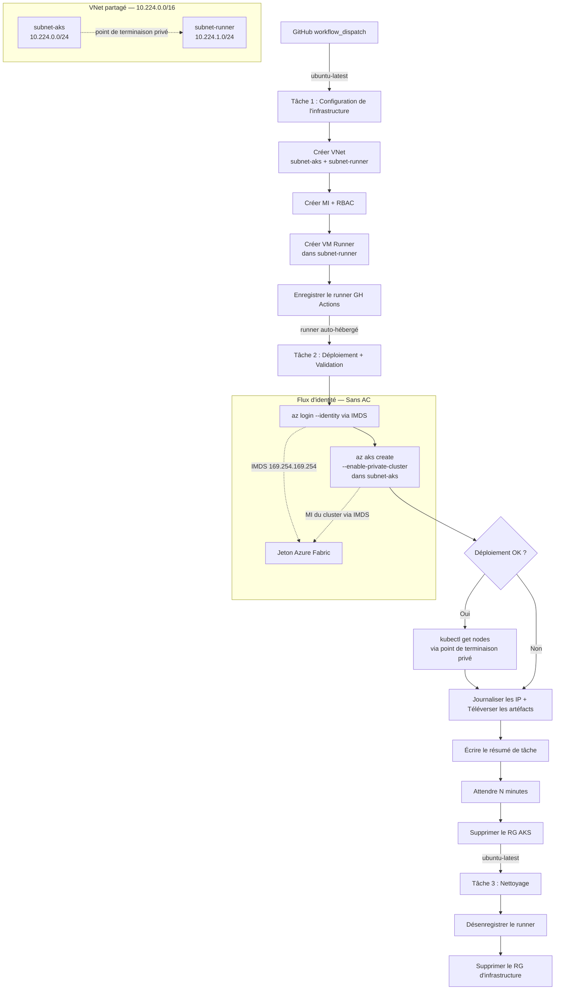

## Vue d'ensemble

Cette preuve de concept valide que l'identité managée Azure contourne les stratégies d'accès conditionnel (AC) d'Entra ID lors du déploiement de clusters AKS privés. Les organisations ayant des stratégies AC strictes basées sur la localisation peuvent utiliser l'identité managée pour éviter les échecs d'authentification qui surviennent avec les principaux de service.

## Énoncé du problème

Lorsque le fournisseur de ressources AKS s'authentifie avec les informations d'identification d'un principal de service lors de l'exécution de `az aks create`, la connexion provient des adresses IP des centres de données Azure, et non du réseau du client. Si l'organisation applique des stratégies d'accès conditionnel qui restreignent l'authentification aux adresses IP du périmètre connu, ces stratégies bloquent la connexion du principal de service car l'adresse IP du centre de données Azure se situe en dehors de la plage autorisée.

C'est la cause confirmée des échecs de déploiement dans les environnements appliquant un accès conditionnel basé sur la localisation pour les identités de charge de travail.

## Solution

L'identité managée contourne entièrement l'accès conditionnel. Les jetons MI sont acquis en interne via IMDS (`169.254.169.254`), et non via `login.microsoftonline.com`. Le moteur AC n'évalue pas du tout les demandes de jetons d'identité managée. Selon la documentation Microsoft : « Les identités managées ne sont pas couvertes par les stratégies. »

En exécutant `az aks create --enable-managed-identity` depuis une VM runner auto-hébergée qui s'authentifie elle-même via `az login --identity`, toute l'authentification reste au sein de l'infrastructure Azure. Aucune connexion externe ne se produit, donc aucune évaluation de stratégie AC n'est déclenchée.

## Architecture

Le workflow s'exécute en trois tâches sur deux types de runners. La tâche 1 provisionne l'infrastructure sur un runner hébergé par GitHub ; la tâche 2 déploie et valide AKS depuis le runner auto-hébergé à l'intérieur du VNet ; la tâche 3 supprime l'ensemble des ressources.



## Comparaison des flux d'authentification

```text
FLUX PRINCIPAL DE SERVICE (PROBLÉMATIQUE) :
VM Runner → az login --service-principal → login.microsoftonline.com (depuis IP du runner ✓)
VM Runner → az aks create → ARM → AKS RP → login.microsoftonline.com (depuis IP du centre de données Azure ✗)
                                                                       ↑ BLOQUÉ par l'AC

FLUX IDENTITÉ MANAGÉE (RECOMMANDÉ) :
VM Runner → az login --identity → IMDS 169.254.169.254 (interne, pas d'AC ✓)
VM Runner → az aks create → ARM → AKS RP → jeton Azure fabric (interne, pas d'AC ✓)
                                                                ↑ NON évalué par l'AC
```

La distinction est architecturale : les identités managées ne déclenchent pas l'accès conditionnel car leurs informations d'identification sont gérées par Azure et l'émission de jetons s'effectue au sein de l'infrastructure Azure. Il n'y a pas d'« adresse IP source » à évaluer par l'AC.

## Prérequis

* Abonnement Azure avec les permissions de créer des clusters AKS, des VM, des VNets et des identités managées
* Un enregistrement d'application Azure AD avec des informations d'identification fédérées OIDC pour GitHub Actions (utilisé par les tâches 1 et 3 sur `ubuntu-latest`)
* Le principal de service OIDC nécessite les rôles `Contributeur` + `Administrateur de l'accès utilisateur` au niveau de l'abonnement
* Dépôt GitHub avec Actions activé
* Un PAT GitHub (secret `GH_PAT`) avec le scope `repo` pour l'enregistrement/désenregistrement du runner

## Démarrage rapide

1. Créer un enregistrement d'application Azure AD avec des informations d'identification fédérées OIDC pour la branche `main` de ce dépôt.

2. Attribuer les rôles `Contributeur` + `Administrateur de l'accès utilisateur` au principal de service de l'application au niveau de l'abonnement.

3. Ajouter ces secrets GitHub Actions au dépôt :
   * `AZURE_CLIENT_ID` : L'identifiant client de l'enregistrement d'application (pour OIDC sur les runners hébergés par GitHub)
   * `AZURE_TENANT_ID` : L'identifiant de votre locataire Entra ID
   * `AZURE_SUBSCRIPTION_ID` : L'identifiant de l'abonnement Azure cible
   * `GH_PAT` : Un PAT GitHub avec le scope `repo` (pour l'enregistrement du runner)

4. Déclencher le workflow **deploy-private-aks** depuis l'interface GitHub Actions (workflow_dispatch).

5. Le workflow provisionne automatiquement une VM runner dans le VNet AKS, déploie le cluster privé, le valide avec `kubectl`, puis supprime l'ensemble des ressources.

6. Alternativement, exécuter `scripts/deploy-private-aks.sh` directement sur toute VM disposant d'une identité managée avec les permissions requises.

## Structure des fichiers

```text
.
├── .github/
│   └── workflows/
│       ├── deploy-private-aks.yml      # Workflow principal de déploiement + journalisation + nettoyage
│       └── cleanup-safety-net.yml      # Filet de sécurité horaire pour les ressources orphelines
├── scripts/
│   ├── setup-runner-vm.sh              # Ponctuel : provisionner la VM runner + MI
│   ├── teardown-runner-vm.sh           # Ponctuel : supprimer la VM runner
│   ├── deploy-private-aks.sh           # Déploiement AKS autonome (réutilisable)
│   └── log-ips.sh                      # Utilitaire de journalisation des IP
└── README.md
```

## Workflows GitHub Actions

### deploy-private-aks.yml

Un workflow à trois tâches déclenché par `workflow_dispatch` :

* **Tâche 1 (`setup-runner`)** : S'exécute sur `ubuntu-latest` via OIDC. Crée un VNet partagé avec deux sous-réseaux (`subnet-aks` et `subnet-runner`), provisionne une identité managée avec RBAC, crée une VM runner dans `subnet-runner` et l'enregistre comme runner auto-hébergé GitHub Actions.
* **Tâche 2 (`deploy-and-log`)** : S'exécute sur le runner auto-hébergé. S'authentifie via l'identité managée (IMDS), déploie un cluster AKS privé dans `subnet-aks`, valide le cluster avec `kubectl` (possible car le runner se trouve dans le même VNet), journalise les IP, téléverse tous les journaux comme artéfacts et rédige un résumé de tâche structuré.
* **Tâche 3 (`teardown-runner`)** : S'exécute sur `ubuntu-latest`. Désenregistre le runner, supprime le groupe de ressources AKS (filet de sécurité) et supprime le groupe de ressources d'infrastructure. S'exécute toujours, même si les tâches précédentes échouent.

### cleanup-safety-net.yml

Un workflow déclenché manuellement (planification désactivée) qui recherche les groupes de ressources correspondant au modèle `rg-aks-poc-*` datant de plus de 45 minutes. Sert de filet de sécurité pour supprimer les ressources orphelines laissées par des exécutions de déploiement échouées ou interrompues.

## Journalisation des IP

Le PoC capture les adresses IP de plusieurs sources pour confirmer que l'authentification par identité managée ne passe pas par des points de terminaison externes :

* **IP sortante du runner** : Capturée via `curl -s ifconfig.me`. Établit l'adresse IP publique de référence de la VM runner.
* **Journal d'activité Azure** : Interrogé via `az monitor activity-log list`. Le champ `httpRequest.clientIpAddress` indique quelle adresse IP a initié chaque opération ARM. Si ces adresses IP correspondent à celle du runner, le trafic est acheminé comme prévu.
* **Journaux de connexion Entra ID** (optionnel, nécessite P1/P2) : Interrogés via l'API Microsoft Graph. Affiche les événements de connexion d'identité managée et leurs adresses IP source dans la catégorie « Connexions d'identité managée ».

Pour vérifier le comportement correct, comparer les adresses IP du journal d'activité avec l'adresse IP sortante du runner. Des adresses IP correspondantes confirment que les appels ARM proviennent de la VM runner plutôt que d'adresses de centres de données Azure inattendues.

## Validation

Le workflow valide trois propriétés clés :

1. **L'identité managée contourne l'AC** : L'acquisition de jetons via IMDS (`169.254.169.254`) reste au sein de l'infrastructure Azure. La comparaison des adresses IP du journal d'activité confirme que les appels ARM proviennent de la VM runner.
2. **Accès à l'API du cluster privé** : La VM runner dans `subnet-runner` peut atteindre le serveur API AKS via son point de terminaison privé dans `subnet-aks` car les deux sous-réseaux partagent le même VNet. La résolution DNS du FQDN privé est vérifiée.
3. **Le cluster est opérationnel** : `kubectl get nodes` confirme que les nœuds sont en état `Ready` et que le cluster est entièrement administrable depuis le VNet.

Tous les résultats de validation, journaux et détails du cluster sont capturés dans le **résumé de tâche** GitHub Actions et téléversés comme **artéfacts** pour chaque exécution.

## Estimation des coûts

Chaque exécution de PoC de 30 minutes coûte environ 0,05 $ à 0,08 $ avec un seul nœud Standard_B2s sur le plan de contrôle AKS gratuit. La VM runner ne fonctionne que pendant la durée du workflow et est automatiquement supprimée.

## Nettoyage

Le workflow gère tout le nettoyage automatiquement via la tâche 3 (`teardown-runner`). Pour un nettoyage manuel :

1. Exécuter `scripts/teardown-runner-vm.sh` pour supprimer l'infrastructure persistante du runner.
2. Désenregistrer tout runner orphelin sous **Settings > Actions > Runners**.

> [!IMPORTANT]
> La tâche 3 du workflow s'exécute toujours (même en cas d'échec) et supprime les groupes de ressources AKS et d'infrastructure. Le nettoyage manuel n'est nécessaire que si le workflow lui-même est annulé avant l'exécution de la tâche 3.

## Références clés

* [Clusters AKS privés Azure](https://learn.microsoft.com/fr-fr/azure/aks/private-clusters)
* [Utiliser l'identité managée avec AKS](https://learn.microsoft.com/fr-fr/azure/aks/use-managed-identity)
* [Accès conditionnel pour les identités de charge de travail](https://learn.microsoft.com/fr-fr/entra/identity/conditional-access/workload-identity)

## Exécution vérifiée — 2 avril 2026

> **Exécution du workflow** : [#23919580744](https://github.com/devopsabcs-engineering/aks-private-deployment/actions/runs/23919580744)
> **Résultat** : Les 3 tâches ont réussi. Objectifs du PoC confirmés.

### Exécution des tâches

| Tâche | Runner | Durée | Résultat |
|-------|--------|-------|----------|
| `setup-runner` | `ubuntu-latest` | 7 min | Succès |
| `deploy-and-log` | `self-hosted` (dans le VNet) | 40 min (incl. 30 min d'attente) | Succès |
| `teardown-runner` | `ubuntu-latest` | 18 sec | Succès |

### Constat 1 : L'identité managée contourne l'accès conditionnel

Le journal d'activité Azure confirme que l'opération d'écriture ARM `az aks create` provient de l'adresse IP `20.104.78.99`, l'adresse IP publique de la VM runner. L'authentification s'est effectuée via IMDS (`169.254.169.254`), et non via `login.microsoftonline.com`. Aucune évaluation d'accès conditionnel n'a été déclenchée.

```text
Extrait du journal d'activité :
  Microsoft.ContainerService/managedClusters/write  Accepted  ClientIp: 20.104.78.99
  Microsoft.ContainerService/managedClusters/write  Started   ClientIp: 20.104.78.99
```

L'action `resolvePrivateLinkServiceId` affiche l'adresse IP `52.136.23.11`. Il s'agit du fournisseur de ressources AKS agissant en interne, un comportement attendu qui ne concerne pas l'identité du client.

### Constat 2 : Le cluster privé est véritablement privé

```text
enablePrivateCluster : true
privateFqdn          : aks-poc-23-rg-aks-poc-23919-...-hzi38m4i.b888736e-...privatelink.canadacentral.azmk8s.io
API Server Endpoint  : https://...privatelink.canadacentral.azmk8s.io:443
Le FQDN privé résout : 10.224.0.4 (adresse IP privée au sein du VNet)
```

Le serveur API AKS est accessible uniquement via le point de terminaison privé. Aucun accès API public n'est possible.

### Constat 3 : La VM runner dans le même VNet atteint le serveur API privé

La VM runner à l'adresse `10.224.1.4` (subnet-runner) s'est connectée avec succès au serveur API AKS à l'adresse `10.224.0.4` (subnet-aks) via le point de terminaison privé :

```text
VM Runner      : 10.224.1.4  (subnet-runner / 10.224.1.0/24)
Nœud AKS       : 10.224.0.5  (subnet-aks / 10.224.0.0/24)
Serveur API    : 10.224.0.4  (point de terminaison privé)
```

`kubectl` a validé le cluster de bout en bout :

```text
kubectl cluster-info  → Plan de contrôle Kubernetes en cours d'exécution à ...privatelink.canadacentral.azmk8s.io:443
kubectl get nodes     → 1 nœud, Ready, v1.34.4
kubectl get pods -n kube-system → 15 pods, tous en cours d'exécution
kubectl get namespaces → default, kube-node-lease, kube-public, kube-system
nslookup FQDN privé → 10.224.0.4 ✓
```

### Constat 4 : Artéfacts téléversés

Six fichiers de journaux ont été téléversés comme artéfacts du workflow (`aks-poc-logs-23919580744`) :

| Fichier de journal | Contenu |
|--------------------|---------|
| `runner-network.log` | IP publique/privée de la VM runner, nom d'hôte, sous-réseau |
| `aks-create.log` | Sortie complète de `az aks create` (9 Ko) |
| `aks-cluster-info.log` | Propriétés du cluster (version, FQDN, configuration réseau) |
| `kubectl-validation.log` | Toute la sortie kubectl incluant la résolution DNS |
| `ip-activity-log.log` | IP des appelants des opérations ARM du journal d'activité Azure |
| `ip-signin-log.log` | Requête de connexion Entra (erreur 403 attendue sans P1/P2) |

### Conclusion

Le PoC confirme que l'identité managée est la solution appropriée pour déployer des clusters AKS privés dans des environnements avec des stratégies d'accès conditionnel basées sur la localisation. La VM runner auto-hébergée, placée dans le même VNet que le cluster AKS, peut à la fois déployer et gérer le cluster privé sans déclencher aucune évaluation d'accès conditionnel.
