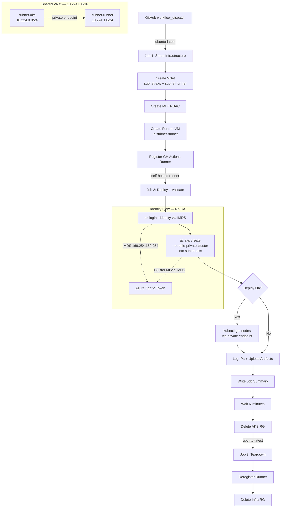

## Overview

This proof of concept validates that Azure Managed Identity bypasses Entra ID conditional access (CA) policies when deploying private AKS clusters. Organizations with strict CA location policies can use managed identity to avoid authentication failures that occur with service principals.

## Problem Statement

When AKS Resource Provider authenticates using a service principal's credentials during `az aks create`, the sign-in originates from Azure datacenter IPs, not from the customer's network. If the organization enforces conditional access policies that restrict authentication to known perimeter IPs, these policies block the service principal sign-in because the Azure datacenter IP falls outside the allowed range.

This is the confirmed root cause of deployment failures in environments with location-based conditional access for workload identities.

## Solution

Managed identity bypasses conditional access entirely. MI tokens are acquired internally via IMDS (`169.254.169.254`), not through `login.microsoftonline.com`. The CA engine does not evaluate managed identity token requests at all. Per Microsoft documentation: "Managed identities aren't covered by policy."

By running `az aks create --enable-managed-identity` from a self-hosted runner VM that itself authenticates via `az login --identity`, all authentication stays within the Azure fabric. No external sign-in occurs, so no CA policy evaluation is triggered.

## Architecture

The workflow runs in three jobs across two runner types. Job 1 provisions infrastructure on a GitHub-hosted runner; Job 2 deploys and validates AKS from the self-hosted runner inside the VNet; Job 3 tears everything down.



## Authentication Flow Comparison

```text
SERVICE PRINCIPAL FLOW (PROBLEMATIC):
Runner VM → az login --service-principal → login.microsoftonline.com (from Runner IP ✓)
Runner VM → az aks create → ARM → AKS RP → login.microsoftonline.com (from Azure datacenter IP ✗)
                                                                      ↑ BLOCKED by CA

MANAGED IDENTITY FLOW (RECOMMENDED):
Runner VM → az login --identity → IMDS 169.254.169.254 (internal, no CA ✓)
Runner VM → az aks create → ARM → AKS RP → Azure fabric token (internal, no CA ✓)
                                                                ↑ NOT evaluated by CA
```

The distinction is architectural: managed identities do not trigger conditional access because their credentials are managed by Azure and token issuance happens within the Azure fabric. There is no "source IP" for CA to evaluate.

## Prerequisites

* Azure subscription with permissions to create AKS clusters, VMs, VNets, and managed identities
* An Azure AD app registration with OIDC federated credentials for GitHub Actions (used by Jobs 1 and 3 on `ubuntu-latest`)
* The OIDC service principal needs `Contributor` + `User Access Administrator` at subscription scope
* GitHub repository with Actions enabled
* A GitHub PAT (`GH_PAT` secret) with `repo` scope for runner registration/deregistration

## Quick Start

1. Create an Azure AD app registration with OIDC federated credentials for the `main` branch of this repository.

2. Assign `Contributor` + `User Access Administrator` roles to the app's service principal at subscription scope.

3. Add these GitHub Actions secrets to the repository:
   * `AZURE_CLIENT_ID`: The app registration client ID (for OIDC on GitHub-hosted runners)
   * `AZURE_TENANT_ID`: Your Entra ID tenant ID
   * `AZURE_SUBSCRIPTION_ID`: Target Azure subscription ID
   * `GH_PAT`: A GitHub PAT with `repo` scope (for runner registration)

4. Trigger the **deploy-private-aks** workflow from the GitHub Actions UI (workflow_dispatch).

5. The workflow automatically provisions a runner VM in the AKS VNet, deploys the private cluster, validates it with `kubectl`, and tears everything down.

6. Alternatively, run `scripts/deploy-private-aks.sh` directly on any VM that has a managed identity with the required permissions.

## File Structure

```text
.
├── .github/
│   └── workflows/
│       ├── deploy-private-aks.yml      # Main deploy + log + teardown workflow
│       └── cleanup-safety-net.yml      # Hourly safety net for orphaned resources
├── scripts/
│   ├── setup-runner-vm.sh              # One-time: provision runner VM + MI
│   ├── teardown-runner-vm.sh           # One-time: delete runner VM
│   ├── deploy-private-aks.sh           # Standalone AKS deployment (reusable)
│   └── log-ips.sh                      # IP logging utility
└── README.md
```

## GitHub Actions Workflows

### deploy-private-aks.yml

A three-job workflow triggered by `workflow_dispatch`:

* **Job 1 (`setup-runner`)**: Runs on `ubuntu-latest` via OIDC. Creates a shared VNet with two subnets (`subnet-aks` and `subnet-runner`), provisions a managed identity with RBAC, creates a runner VM in `subnet-runner`, and registers it as a GitHub Actions self-hosted runner.
* **Job 2 (`deploy-and-log`)**: Runs on the self-hosted runner. Authenticates via managed identity (IMDS), deploys a private AKS cluster into `subnet-aks`, validates the cluster with `kubectl` (possible because the runner is in the same VNet), logs IPs, uploads all logs as artifacts, and writes a structured job summary.
* **Job 3 (`teardown-runner`)**: Runs on `ubuntu-latest`. Deregisters the runner, deletes the AKS resource group (safety net), and deletes the infrastructure resource group. Always runs, even if previous jobs fail.

### cleanup-safety-net.yml

A manually triggered workflow (schedule disabled) that scans for resource groups matching the `rg-aks-poc-*` pattern older than 45 minutes. Acts as a safety net to delete orphaned resources left behind by failed or interrupted deployment runs.

## IP Logging

The PoC captures IP addresses from multiple sources to confirm that managed identity authentication does not route through external endpoints:

* **Runner outbound IP**: Captured via `curl -s ifconfig.me`. This establishes the baseline public IP of the runner VM.
* **Azure Activity Log**: Queried via `az monitor activity-log list`. The `httpRequest.clientIpAddress` field shows which IP initiated each ARM operation. If these IPs match the runner IP, traffic is routing as expected.
* **Entra ID sign-in logs** (optional, requires P1/P2): Queried via Microsoft Graph API. Shows managed identity sign-in events and their source IPs under the "Managed identity sign-ins" category.

To verify correct behavior, compare the Activity Log IPs against the runner outbound IP. Matching IPs confirm that ARM calls originate from the runner VM rather than from unexpected Azure datacenter addresses.

## Validation

The workflow validates three key properties:

1. **Managed Identity bypasses CA**: Token acquisition via IMDS (`169.254.169.254`) stays within the Azure fabric. Activity Log IP comparison confirms ARM calls originate from the runner VM.
2. **Private cluster API access**: The runner VM in `subnet-runner` can reach the AKS API server via its private endpoint in `subnet-aks` because both subnets share the same VNet. DNS resolution of the private FQDN is verified.
3. **Cluster is operational**: `kubectl get nodes` confirms nodes are `Ready` and the cluster is fully manageable from within the VNet.

All validation results, logs, and cluster details are captured in the GitHub Actions **Job Summary** and uploaded as **artifacts** for each run.

## Cost Estimate

Each 30-minute PoC run costs approximately $0.05 to $0.08 with a single Standard_B2s node on the Free tier AKS control plane. The runner VM runs only for the duration of the workflow and is automatically deleted.

## Cleanup

The workflow handles all cleanup automatically via Job 3 (`teardown-runner`). For manual cleanup:

1. Run `scripts/teardown-runner-vm.sh` to delete persistent runner infrastructure.
2. Deregister any orphaned runners under **Settings > Actions > Runners**.

> [!IMPORTANT]
> The workflow's Job 3 always runs (even on failure) and cleans up both the AKS and infrastructure resource groups. Manual cleanup is only needed if the workflow itself is cancelled before Job 3 executes.

## Key References

* [Azure Private AKS Clusters](https://learn.microsoft.com/en-us/azure/aks/private-clusters?pivots=azure-cli)
* [Use Managed Identity with AKS](https://learn.microsoft.com/en-us/azure/aks/use-managed-identity)
* [Conditional Access for Workload Identities](https://learn.microsoft.com/en-us/entra/identity/conditional-access/workload-identity)

## Verified Run — April 2, 2026

> **Workflow run**: [#23919580744](https://github.com/devopsabcs-engineering/aks-private-deployment/actions/runs/23919580744)
> **Result**: All 3 jobs succeeded. PoC objectives confirmed.

### Job execution

| Job | Runner | Duration | Result |
|-----|--------|----------|--------|
| `setup-runner` | `ubuntu-latest` | 7 min | Success |
| `deploy-and-log` | `self-hosted` (in-VNet) | 40 min (incl. 30 min wait) | Success |
| `teardown-runner` | `ubuntu-latest` | 18 sec | Success |

### Finding 1: Managed Identity bypasses Conditional Access

The Azure Activity Log confirms the `az aks create` ARM write operation originated from IP `20.104.78.99` — the runner VM's own public IP. Authentication happened via IMDS (`169.254.169.254`), not through `login.microsoftonline.com`. No Conditional Access evaluation was triggered.

```text
Activity Log excerpt:
  Microsoft.ContainerService/managedClusters/write  Accepted  ClientIp: 20.104.78.99
  Microsoft.ContainerService/managedClusters/write  Started   ClientIp: 20.104.78.99
```

The `resolvePrivateLinkServiceId` action shows IP `52.136.23.11`. This is the AKS Resource Provider acting internally — expected behavior, not the customer's identity.

### Finding 2: Private cluster is truly private

```text
enablePrivateCluster : true
privateFqdn          : aks-poc-23-rg-aks-poc-23919-...-hzi38m4i.b888736e-...privatelink.canadacentral.azmk8s.io
API Server Endpoint  : https://...privatelink.canadacentral.azmk8s.io:443
Private FQDN resolves: 10.224.0.4 (private IP within the VNet)
```

The AKS API server is accessible only via private endpoint. No public API access is possible.

### Finding 3: Runner VM in same VNet reaches private API server

The runner VM at `10.224.1.4` (subnet-runner) successfully connected to the AKS API server at `10.224.0.4` (subnet-aks) via the private endpoint:

```text
Runner VM  : 10.224.1.4  (subnet-runner / 10.224.1.0/24)
AKS Node   : 10.224.0.5  (subnet-aks / 10.224.0.0/24)
API Server : 10.224.0.4  (private endpoint)
```

`kubectl` validated the cluster end-to-end:

```text
kubectl cluster-info  → Kubernetes control plane running at ...privatelink.canadacentral.azmk8s.io:443
kubectl get nodes     → 1 node, Ready, v1.34.4
kubectl get pods -n kube-system → 15 pods, all Running
kubectl get namespaces → default, kube-node-lease, kube-public, kube-system
nslookup private FQDN → 10.224.0.4 ✓
```

### Finding 4: Artifacts uploaded

Six log files were uploaded as workflow artifacts (`aks-poc-logs-23919580744`):

| Log file | Content |
|----------|---------|
| `runner-network.log` | Runner VM public/private IP, hostname, subnet |
| `aks-create.log` | Full `az aks create` output (9 KB) |
| `aks-cluster-info.log` | Cluster properties (version, FQDN, network config) |
| `kubectl-validation.log` | All kubectl output including DNS resolution |
| `ip-activity-log.log` | Azure Activity Log ARM operation caller IPs |
| `ip-signin-log.log` | Entra sign-in query (expected 403 without P1/P2) |

### Conclusion

The PoC confirms that managed identity is the correct solution for deploying private AKS clusters in environments with Conditional Access location policies. The self-hosted runner VM, placed inside the same VNet as the AKS cluster, can both deploy and manage the private cluster without triggering any CA evaluation.
