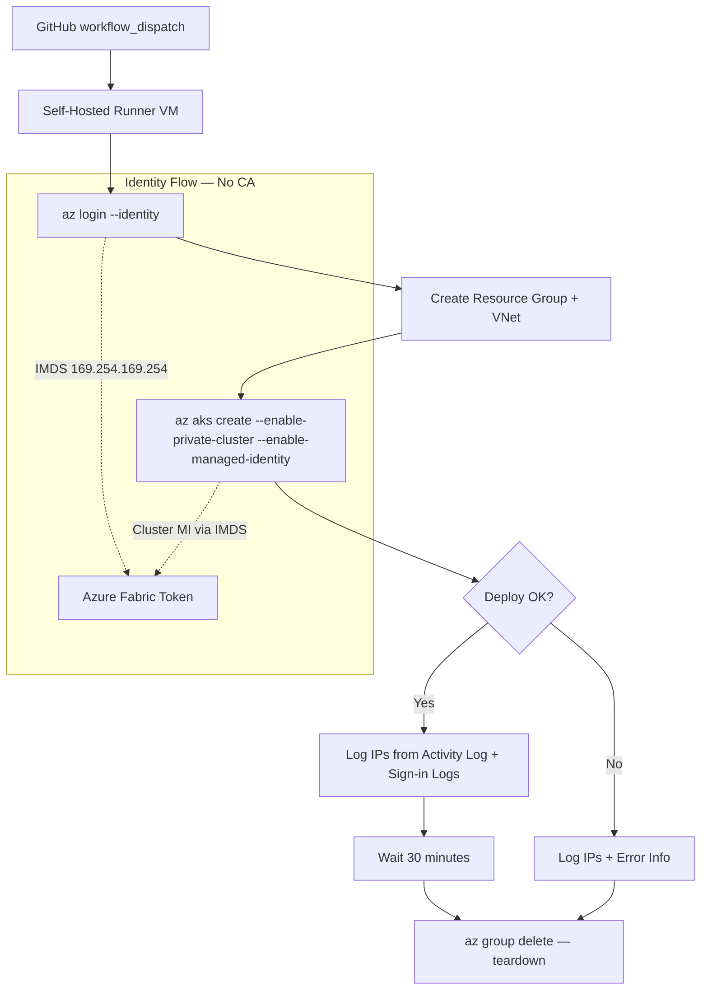

## Overview

This proof of concept validates that Azure Managed Identity bypasses Entra ID conditional access (CA) policies when deploying private AKS clusters. Organizations with strict CA location policies can use managed identity to avoid authentication failures that occur with service principals.

## Problem Statement

When AKS Resource Provider authenticates using a service principal's credentials during `az aks create`, the sign-in originates from Azure datacenter IPs, not from the customer's network. If the organization enforces conditional access policies that restrict authentication to known perimeter IPs, these policies block the service principal sign-in because the Azure datacenter IP falls outside the allowed range.

This is the confirmed root cause of deployment failures in environments with location-based conditional access for workload identities.

## Solution

Managed identity bypasses conditional access entirely. MI tokens are acquired internally via IMDS (`169.254.169.254`), not through `login.microsoftonline.com`. The CA engine does not evaluate managed identity token requests at all. Per Microsoft documentation: "Managed identities aren't covered by policy."

By running `az aks create --enable-managed-identity` from a self-hosted runner VM that itself authenticates via `az login --identity`, all authentication stays within the Azure fabric. No external sign-in occurs, so no CA policy evaluation is triggered.

## Architecture



## Authentication Flow Comparison

```text
SERVICE PRINCIPAL FLOW (PROBLEMATIC):
Runner VM → az login --service-principal → login.microsoftonline.com (from Runner IP ✓)
Runner VM → az aks create → ARM → AKS RP → login.microsoftonline.com (from Azure datacenter IP ✗)
                                                                      ↑ BLOCKED by CA

MANAGED IDENTITY FLOW (RECOMMENDED):
Runner VM → az login --identity → IMDS 169.254.169.254 (internal, no CA ✓)
Runner VM → az aks create → ARM → AKS RP → Azure fabric token (internal, no CA ✓)
                                                                ↑ NOT evaluated by CA
```

The distinction is architectural: managed identities do not trigger conditional access because their credentials are managed by Azure and token issuance happens within the Azure fabric. There is no "source IP" for CA to evaluate.

## Prerequisites

* Azure subscription with permissions to create AKS clusters and managed identities
* Azure CLI v2.28.0 or later
* GitHub repository with Actions enabled
* Self-hosted runner VM in Azure with a user-assigned managed identity (`Contributor` + `User Access Administrator` on the subscription)

## Quick Start

1. Run `scripts/setup-runner-vm.sh` to provision the runner VM and managed identity in `rg-aks-poc-runner`.

2. SSH into the VM and configure the GitHub Actions self-hosted runner. Follow
   [Adding self-hosted runners](https://docs.github.com/en/actions/hosting-your-own-runners/managing-self-hosted-runners/adding-self-hosted-runners).

3. Add these GitHub Actions secrets to the repository:
   * `AZURE_CLIENT_ID`: The client ID of the managed identity `mi-aks-poc-deployer`
   * `AZURE_TENANT_ID`: Your Entra ID tenant ID
   * `AZURE_SUBSCRIPTION_ID`: Target Azure subscription ID

4. Trigger the **deploy-private-aks** workflow from the GitHub Actions UI (workflow_dispatch).

5. Alternatively, run `scripts/deploy-private-aks.sh` directly on any VM that has a managed identity with the required permissions.

## File Structure

```text
.
├── .github/
│   └── workflows/
│       ├── deploy-private-aks.yml      # Main deploy + log + teardown workflow
│       └── cleanup-safety-net.yml      # Hourly safety net for orphaned resources
├── scripts/
│   ├── setup-runner-vm.sh              # One-time: provision runner VM + MI
│   ├── teardown-runner-vm.sh           # One-time: delete runner VM
│   ├── deploy-private-aks.sh           # Standalone AKS deployment (reusable)
│   └── log-ips.sh                      # IP logging utility
└── README.md
```

## GitHub Actions Workflows

### deploy-private-aks.yml

A 13-step workflow triggered by `workflow_dispatch`. It authenticates via managed identity, creates a resource group (`rg-aks-poc-<run_id>`), deploys a private AKS cluster, logs IP addresses from Azure Activity Log and Entra ID sign-in logs, waits 30 minutes for log propagation, and tears down all resources. A Dead Man's Switch pattern ensures cleanup runs even if intermediate steps fail.

### cleanup-safety-net.yml

An hourly cron-triggered workflow that scans for resource groups matching the `rg-aks-poc-*` pattern older than 45 minutes. This acts as a safety net to delete orphaned resources left behind by failed or interrupted deployment runs.

## IP Logging

The PoC captures IP addresses from multiple sources to confirm that managed identity authentication does not route through external endpoints:

* **Runner outbound IP**: Captured via `curl -s ifconfig.me`. This establishes the baseline public IP of the runner VM.
* **Azure Activity Log**: Queried via `az monitor activity-log list`. The `httpRequest.clientIpAddress` field shows which IP initiated each ARM operation. If these IPs match the runner IP, traffic is routing as expected.
* **Entra ID sign-in logs** (optional, requires P1/P2): Queried via Microsoft Graph API. Shows managed identity sign-in events and their source IPs under the "Managed identity sign-ins" category.

To verify correct behavior, compare the Activity Log IPs against the runner outbound IP. Matching IPs confirm that ARM calls originate from the runner VM rather than from unexpected Azure datacenter addresses.

## Cost Estimate

Each 30-minute PoC run costs approximately $0.05 to $0.08 with a single Standard_B2s node on the Free tier AKS control plane. The runner VM is the primary ongoing cost at approximately $0.042/hr when running.

## Cleanup

1. Run `scripts/teardown-runner-vm.sh` to delete the runner VM, managed identity, and the `rg-aks-poc-runner` resource group.
2. Deregister the self-hosted runner from your GitHub repository under **Settings > Actions > Runners**.

> [!IMPORTANT]
> The cleanup-safety-net workflow handles PoC resource groups automatically, but the runner VM infrastructure requires manual teardown.

## Key References

* [Azure Private AKS Clusters](https://learn.microsoft.com/en-us/azure/aks/private-clusters)
* [Use Managed Identity with AKS](https://learn.microsoft.com/en-us/azure/aks/use-managed-identity)
* [Conditional Access for Workload Identities](https://learn.microsoft.com/en-us/entra/identity/conditional-access/workload-identity)
